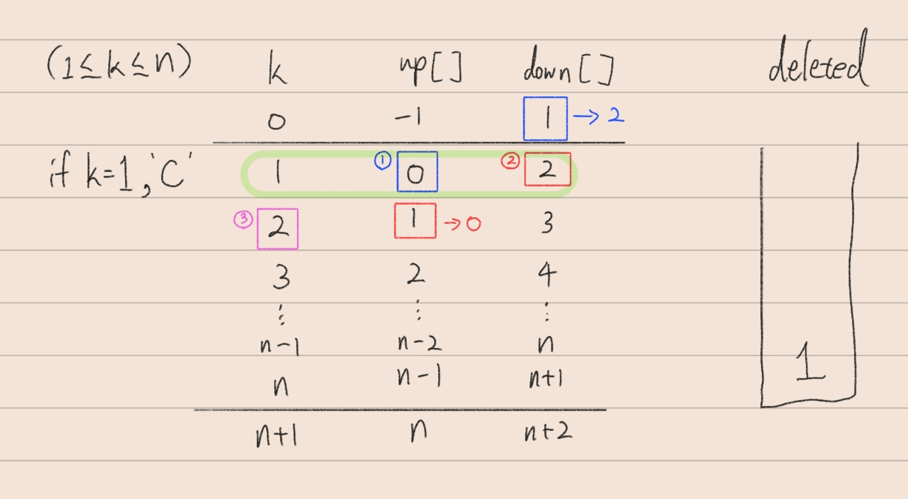

**닉네임**: kchoo

**문제 플랫폼**: 프로그래머스

**문제 이름 또는 번호**: 표 편집

**문제 링크**: https://school.programmers.co.kr/learn/courses/30/lessons/81303?language=cpp

**오늘의 메모(선택)**:  
실제 삽입삭제 대신 인덱스 연산  
더미 행 활용  
문제의 'C'는 cut의 약자로 추정됨  
stoi는 C++11  


**코드(선택)**:

```c++
#include <string>
#include <vector>
#include <stack>

using namespace std;

string solution(int n, int k, vector<string> cmd) {
    stack<int> deleted;

    vector<int> up;
    vector<int> down;

    for (int i = 0; i < n + 2; i++) {
        up.push_back(i - 1);
        down.push_back(i + 1);
    }
    k = k + 1;

    for (int i = 0; i < cmd.size(); i++) {
        if (cmd[i][0] == 'C') {
            deleted.push(k);
            down[up[k]] = down[k];
            up[down[k]] = up[k];

            if (down[k] == n + 1)
                k = up[k];
            else
                k = down[k];
        }
        else if (cmd[i][0] == 'Z') {
            int r = deleted.top();
            down[up[r]] = r;
            up[down[r]] = r;
            deleted.pop();
        }
        else {
            int X = stoi(cmd[i].substr(2));

            if (cmd[i][0] == 'U') {
                for (int j = 0; j < X; j++) {
                    k = up[k];
                }
            }
            else {
                for (int j = 0; j < X; j++) {
                    k = down[k];
                }
            }
        }
    }

    string answer;
    answer.append(n, 'O');
    while (!deleted.empty()) {
        answer[deleted.top() - 1] = 'X';
        deleted.pop();
    }

    return answer;
}
```
