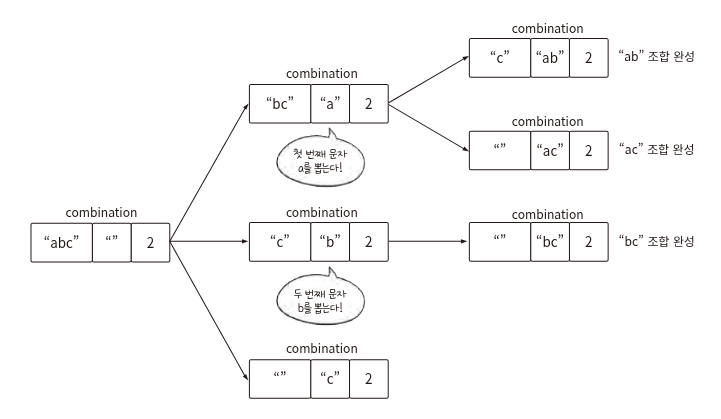

**닉네임**: kchoo

**문제 플랫폼**: 프로그래머스

**문제 이름 또는 번호**: 메뉴 리뉴얼

**문제 링크**: https://school.programmers.co.kr/learn/courses/30/lessons/72411

**오늘의 메모(선택)**:  
재귀로 조합 구하기 로직이 쉽지않다


**코드(선택)**: 

```c++
#include <string>
#include <vector>
#include <algorithm>
#include <map>

using namespace std;

map<string, int> combi;

void combination(string src, string dst, int depth)
{
	if (dst.size() == depth)
		combi[dst]++;
	else
	{
		for (int i = 0; i < src.size(); i++)
		{
			string next = src.substr(i + 1);
			combination(next, dst + src[i], depth);
		}
	}
}

vector<string> solution(vector<string> orders, vector<int> course)
{
	vector<string> answer;

	for (string &order : orders)
		sort(order.begin(), order.end());

	for (int len : course)
	{
		for (string &order : orders)
			combination(order, "", len);

		int maxOrder = 0;
		for (auto it : combi)
			maxOrder = max(maxOrder, it.second);

		for (auto it : combi)
			if (maxOrder >= 2 && it.second == maxOrder)
				answer.push_back(it.first);
		combi.clear();
	}

	sort(answer.begin(), answer.end());
	return answer;
}
```
