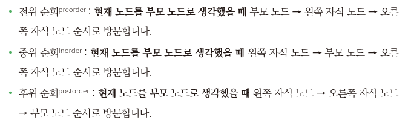

**닉네임**: kchoo

**문제 플랫폼**: 프로그래머스

**문제 이름 또는 번호**: 길 찾기 게임

**문제 링크**: https://school.programmers.co.kr/learn/courses/30/lessons/42892

**오늘의 메모(선택)**: 

이진 트리 및 순회 구현



**코드(선택)**: 

```c++
#include <string>
#include <vector>
#include <algorithm>

using namespace std;

struct Node
{
	int id, x, y;
	Node *left = nullptr;
	Node *right = nullptr;
	Node(int id, int x, int y) : id(id), x(x), y(y) {}
};

class BinaryTree
{
private:
	Node *_root;

	static bool compareNodes(Node *a, Node *b)
	{
		if (a->y != b->y)
			return a->y > b->y;
		return a->x < b->x;
	}

	Node *addNode(Node *current, Node *newNode)
	{
		if (current == nullptr)
			return newNode;
		if (newNode->x < current->x)
			current->left = addNode(current->left, newNode);
		else
			current->right = addNode(current->right, newNode);
		return current;
	}

	void preOrder(Node *node, vector<int> &traversal)
	{
		if (node == nullptr)
			return;
		traversal.push_back(node->id);
		preOrder(node->left, traversal);
		preOrder(node->right, traversal);
	}

	void postOrder(Node *node, vector<int> &traversal)
	{
		if (node == nullptr)
			return;
		postOrder(node->left, traversal);
		postOrder(node->right, traversal);
		traversal.push_back(node->id);
	}

public:
	BinaryTree() : _root(nullptr) {}
	~BinaryTree()
	{
		deleteTree(_root);
	}

	void buildTree(vector<vector<int>> &nodeinfo)
	{
		vector<Node *> nodes;
		for (int i = 0; i < nodeinfo.size(); ++i)
			nodes.push_back(new Node(i + 1, nodeinfo[i][0], nodeinfo[i][1]));
		sort(nodes.begin(), nodes.end(), compareNodes);
		for (Node *node : nodes)
			_root = addNode(_root, node);
	}

	void deleteTree(Node* node) {
		if (node == nullptr) return;
		deleteTree(node->left);
		deleteTree(node->right);
		delete node;
	}

	vector<int> getPreOrderTraversal()
	{
		vector<int> traversal;
		preOrder(_root, traversal);
		return traversal;
	}

	vector<int> getPostOrderTraversal()
	{
		vector<int> traversal;
		postOrder(_root, traversal);
		return traversal;
	}
};

vector<vector<int>> solution(vector<vector<int>> nodeinfo)
{
	BinaryTree tree;
	tree.buildTree(nodeinfo);
	vector<int> preOrder = tree.getPreOrderTraversal();
	vector<int> postOrder = tree.getPostOrderTraversal();
	return {preOrder, postOrder};
}
```
