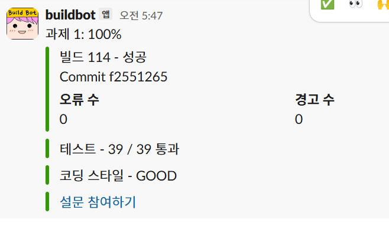

**닉네임**: sejjeong

**문제 플랫폼**: POCU 알고리듬

**문제 이름 또는 번호**: 과제 1

**문제 링크**: 

**오늘의 메모(선택)**: 
            달성률 100%, 
            이진 탐색할 때, index를 잘못 참조한 게 있었음
            데이터 특성을 잘 이용하여 O(N^K) -> O(N log N)으로 줄임

**코드(선택)**:

Java

